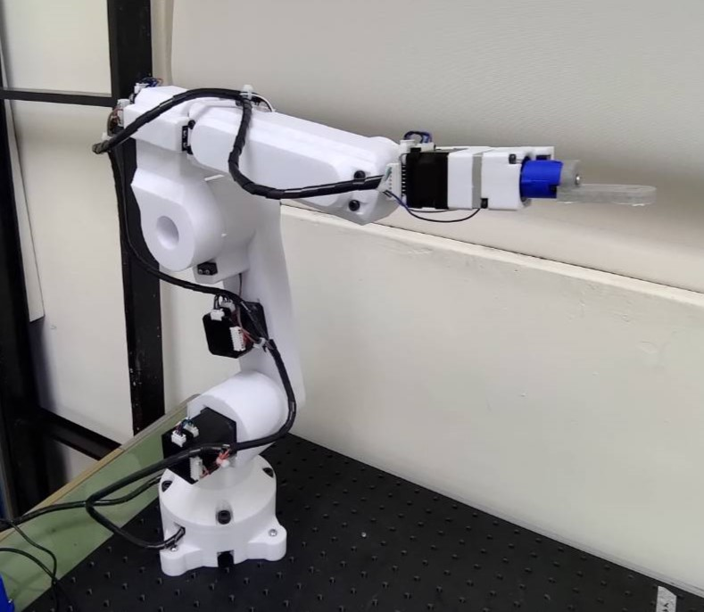

# ALTO 3D Printed 6 Axis Robotic Arm (WIP)

## Introduction
ALTO is a 3D printed robotic arm project I've been working on.

The design was heavily inspired by these following projects:

[Building a 7 Axis Robot from Scratch (By Jeremy Fielding)](https://www.youtube.com/watch?v=HMSLPefUVeE&ab_channel=JeremyFielding)

[I made a DUMMY ROBOTIC ARM from scratch！ (By pengzhihui)](https://www.youtube.com/watch?v=HMSLPefUVeE&ab_channel=JeremyFielding)

Props to them for sharing these amazing projects!


This robotic arm uses harmonic drives as reducers(CSF-11, CSF-8) and steppers as motors(NEMA17, NEMA14).

Therefore, the overall precision of the robot is pretty decent for a 3D printed robot, but it is still no match for robotic arm that has fully CNC frames.

The filament I'm using is PLA+, it provides great stiffness and cheap price, but it still has some deformation when big loads were apply in TCP, which is acceptable for me.

The control box of the robot has a [STM32F407VG](https://www.st.com/en/evaluation-tools/stm32f4discovery.html"link"), a 12V 100W PSU, a 12V to 5V converter and a sn65hvd230 CANBUS transceiver, it can be connected to computer via USB and the robotic arm will be identify as a USB device.


I also wrote an API in Python, so that I can simply use Python code to control the robot and combine other sensors more easily.

```python
import alto

alto_6_axis = alto.Alto(6, com_port="COM10")
alto_6_axis.Alto_Operate()
```

## Hardware


The design of the robot is reference from generic industrial robot, such as [Yasakawa AR1440](https://www.motoman.com/en-us/products/robots/industrial/welding-cutting/ar-series/ar1440) or [Kuka KR CYBERTECH nano](https://www.kuka.com/en-de/products/robot-systems/industrial-robots/kr-cybertech-nano)

The first 3 joints of the robot used NEMA17 stepper motor and CSF-11 gearbox as the joint unit, and the 3 joints were also installed with crossed roller bearings to reduce to vibration and deformation.

3 wrist joints used NEMA14 stepper motor and CSF-8 gearbox, which make the wrist joints lighter and more compact.

Every joint also has its own limit switch, the limit switch is used as a way to calibrate joint's origin(0° of the joint)

The detail of each joint can be found in the table below.

|               |Joint1    |Joint2    |Joint3    |Joint4    |Joint5    |Joint6    |
|:-----         |:----:    |:----:    |:----:    |:----:    |:----:    |:----:    |
|Reduction ratio|50        |50        |30        |30        |30        |30        |
|Gearbox        |CSF-11    |CSF-11    |CSF-11    |CSF-8     |CSF-8     |CSF-8     |
|Stepper motor  |NEMA17    |NEMA17    |NEMA17    |NEMA14    |NEMA14    |NEMA14    |
|Stepper length |40mm      |48mm      |35mm      |28mm      |28mm      |28mm      |
|Bearing        |Rb-4510   |Rb-4510   |Rb-3510   |None      |None      |None      |
|Rotation limit |-180°~180°|-90°~90°  |-90°~90°  |-180°~180°|-120°~120°|-180°~180°|

All of the component that you need to build the robot is shown in the **BOM**(bill of material) in **hardware** folder.

Some of the parts were relatively more expensive, like harmonic drives.

But I've manage to found cheaper alternative in Aliexpress and Taobao, which is a lot cheaper then the original one.

By doing so, I've significantly reduced my cost on the robot, I end up spent around 400USD in total.

Which is a pretty good deal in my opinion.

## Firmware

### Preparation

The code of the control box ([STM32F407VG](https://www.st.com/en/evaluation-tools/stm32f4discovery.html"link")) can be found in the **firmware** folder.

[STM32CubeIDE](https://www.st.com/en/development-tools/stm32cubeide.html) is needed to open the **.project** file.

Once **.project** is opened, all the code, peripheral setting etc... will be shown inside STM32CubeIDE.

The code can also be uploaded or modified in STM32CubeIDE.

### Source Code

The firmware source code can be break down into following sections :
|Section name  |Functionality|
|:-            |:-           |
|alto_config   |Robot configuration|
|command       |Processing user command|
|Emm_can       |Stepper driver CANBUS library|
|FK            |Forward kinematics|
|IK            |Inverse kinematics|
|main          |STM32 main function|
|matmul        |matrix calculation library|
|robot_behavior|Robot system core|
|transform     |Basic robotic mathematics library|

Further details can be found inside the src files.

## API

### Serial Command
Robot can be connected to computer via USB, so you used any serial communication tool like [hterm](https://www.der-hammer.info/pages/terminal.html) to control the robot. 

The command reference file **alto_command.xlsx** is located inside **software** folder.

### Python API

There is also a Python API module in **software** folder named **alto.py**, which is a much easier way to control the robot.

Simply declare a **Alto** class object with correct COM port, then you can use the object's bulid-in method to operate the robot.

```python
import alto

alto_6_axis = alto.Alto(6, com_port="COM10")
alto_6_axis.Alto_Operate()
alto_6_axis.Alto_Stop()
alto_6_axis.Alto_Set_Speed(100)
alto_6_axis.Alto_Set_Acc(80)
alto_6_axis.Alto_Set_Mov(alto.Joint)
alto_6_axis.Alto_Set_Joint_Angle(1, 0)
alto_6_axis.Alto_Set_Joint_Angle(2, 0)
alto_6_axis.Alto_Set_Joint_Angle(3, 0)
alto_6_axis.Alto_Set_Joint_Angle(4, 0)
alto_6_axis.Alto_Set_Joint_Angle(5, 0)
alto_6_axis.Alto_Set_Joint_Angle(6, 0)
alto_6_axis.Alto_Start()
```

## result

### Videos

[IK Test Demo](https://www.youtube.com/watch?v=VYk2PS6qSJA&ab_channel=%E7%A8%8B)


### Robotic Arm




### Control Box


